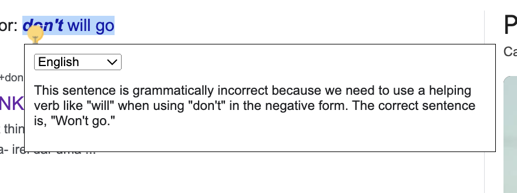

# Chrome Extension for Text Correction with OpenAI API

## Description

This Chrome extension enables users to select text on any web page and receive instant corrections for the selected text using the OpenAI API. An icon will appear next to the selected text, and upon clicking this icon, a modal will display with a language selector and the text correction in the chosen language.

## Features

- Text selection for correction
- Interactive icon to access the correction
- Modal with language selector and text correction
- Language selection storage for future use
- Integration with OpenAI API for real-time corrections

## How to Use

1. Clone this repository to your local machine.
2. Open Chrome and navigate to `chrome://extensions/`.
3. Enable Developer Mode.
4. Click on "Load unpacked" and select the folder of the cloned repository.
5. The extension should now be visible and active.
6. Navigate to any web page, select a text, and click on the appearing icon to view the correction.

## Code Structure

- `content.js`: Contains all the JavaScript code to manipulate the DOM, capture the selected text, display the icon and modal, and make requests to the OpenAI API.

## Requirements

- Google Chrome
- OpenAI API Key

## OpenAI API Setup

You need an OpenAI API key to make requests. Replace `'YOUR_OPENAI_API_KEY'` with your API token in the `content.js` file.

## Contributing

Feel free to clone, modify, and distribute this code as needed. Pull requests and improvements are welcome!

## License

This project is open-source and available under the MIT license.

## Support

For assistance or discussions about this project, please open an issue on the repository.
